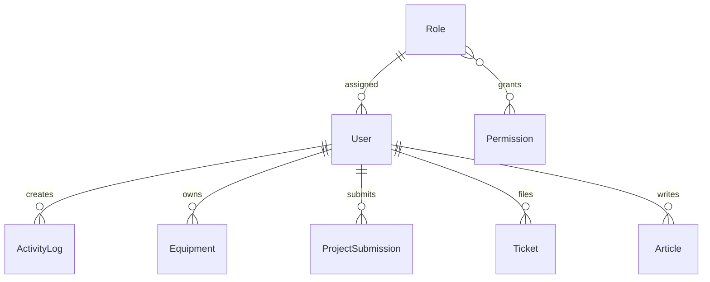

# ERD

```mermaid
erDiagram
User ||--o{ ActivityLog : creates
Role ||--o{ User : assigned
Role }o--o{ Permission : grants
User ||--o{ Equipment : owns
User ||--o{ ProjectSubmission : submits
User ||--o{ Ticket : files
User ||--o{ Article : writes
```
All primary business models use UUID keys, timestamps, status indexes, owner links, and audit logs.
